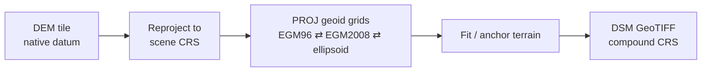

import { Aside } from '@astrojs/starlight/components';

The terrain behind an absolute DSM comes from a public or user-supplied DEM (`geo/dem.py`).

| Source (`dem_source`) | Vertical datum | Resolution | Access |
|---|---|---|---|
| `copernicus30` **(default)** | EGM2008 geoid | ~30 m | AWS open data, no login |
| `srtmgl1` | EGM96 geoid | ~30 m | OpenTopography API key |
| `nasadem` | EGM96 geoid | ~30 m | OpenTopography API key |
| `terrain_tiles` | EGM96 (mixed sources) | varies by zoom | AWS Terrarium tiles |
| `cartodem` | WGS84 ellipsoid | user file | local GeoTIFF via `--dem` |

## Datum handling



Heights are converted between EGM96, EGM2008 and the WGS84 ellipsoid with PROJ geoid grids. The difference between the two geoids is small but not zero, and the geoid–ellipsoid separation can reach tens of metres, so **mixing datums is a common source of large absolute errors**. Reference data uploaded for validation can declare its datum (`EGM96`, `EGM2008` or `WGS84`), and it is converted before scoring.

## Offline use

Fetched DEM tiles are cached. To prepare a demo machine with no network:

```bash
python -m geo.dem --prime scene.tif      # fills the DEM cache for the scene's footprint
```

<Aside>
The web app anchors in the browser using **Terrarium** tiles (`s3.amazonaws.com/elevation-tiles-prod/terrarium/`), or a DEM file you load. The bundled sample ships a `dem_cells.json` so anchoring works offline. See [Elevation anchoring](/guide/anchoring/).
</Aside>
