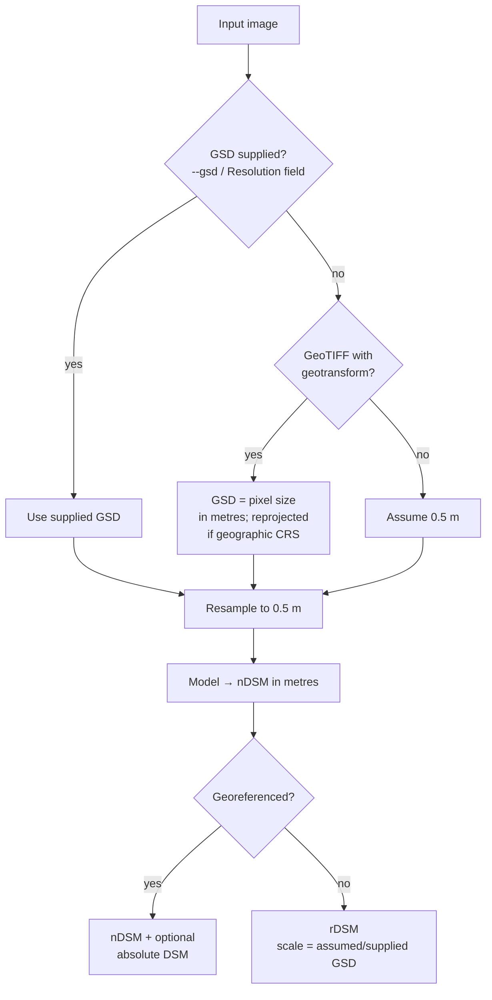

import { Aside } from '@astrojs/starlight/components';

The network predicts height in metres **at 0.5 m GSD**, so every result depends on knowing the input's true pixel size.

## Resolution order

| GSD source | Recorded as (`meta.json → scene.gsd_source`) | Product label |
|---|---|---|
| User value | `user` | nDSM (or rDSM if not georeferenced) |
| GeoTIFF transform | `geotiff` | nDSM / DSM |
| Assumed 0.5 m | `assumed` | **rDSM** |

## Resampling

- Inputs finer than 0.5 m (for example 0.3 m WorldView) are **downsampled** to 0.5 m, predicted, and the height map is resampled back to the input grid.
- Inputs coarser than 0.5 m (for example 0.6 m Cartosat PAN or 1.0 m products) are **upsampled** to 0.5 m. The model cannot recover detail that the image does not contain, but heights stay metric.
- Very large images can be limited with `max_side`. The service switches to windowed processing above 40 MP instead.

## What a wrong GSD does

Height cues such as shadow length, roof size and parallax scale with the true ground distance. If an image is really 1.0 m/px but is processed as 0.5 m/px, every structure looks twice as big in pixel terms and is **predicted roughly twice as tall**. The web app therefore:

- reads the GSD from GeoTIFFs automatically and shows its source,
- warns when no resolution is known and 0.5 m will be assumed,
- labels the result **rDSM** so it is never mistaken for a calibrated product.

<Aside type="tip">For a screenshot from Google Earth or a web map, estimate the GSD from the scale bar (metres ÷ pixels), or measure a known object such as a tennis court (23.77 m long). This is the same method used to [re-measure GAMUS](/training/datasets/#measuring-the-real-gsd).</Aside>

## Multi-band and Cartosat products

- RGB is taken from bands **3, 2, 1** of 4-band products by default. Override it with `bands=` (API) or `--bands`.
- An NRSC product delivered as `BAND1..4.tif + BAND_META.txt` can be uploaded as several files at once, or as a `.zip`.
- 16-bit data is mapped to 8-bit with the scene's 2–98 % stretch, the same as in training.
