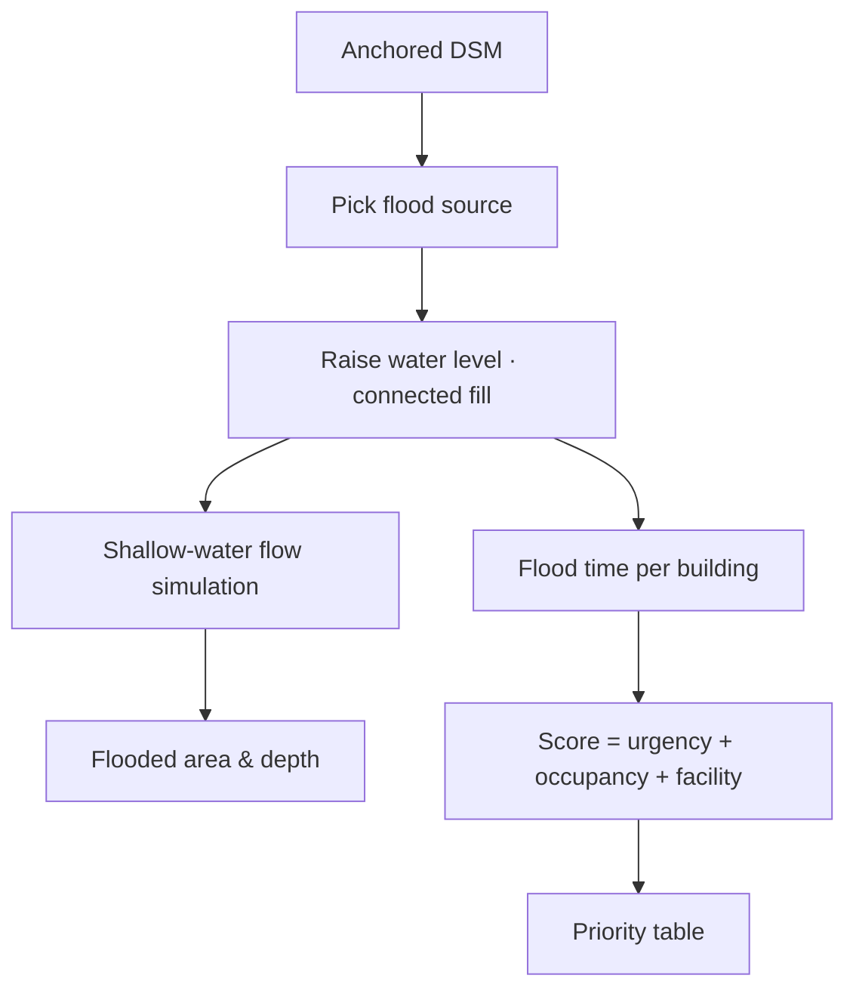

import { Steps, Aside } from '@astrojs/starlight/components';

Scenarios turn a height model into a decision aid. Open them from **Scenarios ▾** in the header or **Tools → Scenarios**.

## Flood response

Water rises from a source and flows out over the terrain, filling the **connected lower ground first**. The flow is simulated with the shallow-water equations (the local inertial scheme used by LISFLOOD-FP, with Manning friction), so the water advances as a front, runs downhill and pools in hollows before it settles at the chosen level. In 3D the water is drawn at its real height: buildings lower than the water are submerged, and taller ones stand out of it with a visible waterline. Buildings are ranked by how soon the water reaches them, how many people they are likely to hold, and whether they house critical facilities.

<Steps>

1. Make sure the scene has **terrain elevation**: it must be georeferenced and anchored ([Anchoring](/guide/anchoring/)). Without terrain, the panel shows *Needs terrain elevation*.
2. Choose a **Flood source**:
   - **Water bodies**: rivers, lakes and ponds detected in the scene;
   - **Chosen point**: click a location on the terrain;
   - **Whole scene**: a uniform rise everywhere.
3. Drag **Water level rise**, or press **Play** to animate it. The water follows as a time-lapse (about 8 simulated minutes per second). The panel reports the flooded area and water depth as the water moves, and marks buildings under their roofline as *submerged*.
4. Optionally enable **Show water on the terrain** and **Shade dry ground by how soon it floods**.
5. Review the **priority table**: each building's tier and score, with ★ marking critical facilities.

</Steps>

**Priority score (0–100)** is a weighted sum of:

- *urgency*: how early the building floods;
- *occupancy proxy*: footprint area × estimated storeys from the predicted height;
- *critical facility*: from OpenStreetMap, once the **Facilities** layer has loaded.

Buildings are grouped into **Critical**, **High** and lower tiers. The exact weights and thresholds are shown in the panel.

## Telecom coverage

Place transmitter towers on the surface and check where the signal reaches, taking terrain, buildings and trees into account.

<Steps>

1. Click **Add a tower**. It is placed at the scene centre. Set each tower's **Height (m)** and **EIRP (dBm)**.
2. Pick a **Frequency, MHz** preset and an **Environment**, and set the **Receiver height (m)**.
3. Enable **Show coverage on the terrain** to drape the coverage map.
4. Read the **coverage breakdown** and the list of the largest **no-service patches** (dead zones).
5. Click **Suggest additional towers** to get placements that close the biggest dead zones.

</Steps>

<Aside type="caution">Both scenarios are **planning aids**, not engineering models. Flooding is a shallow-water simulation over the DEM terrain, on a grid of at most 256 cells a side, with closed scene edges and no rainfall, drainage or flood defences. Coverage is a line-of-sight and path-loss estimate. Their accuracy is bounded by the height model's accuracy ([Error analysis](/results/error-analysis/)).</Aside>
