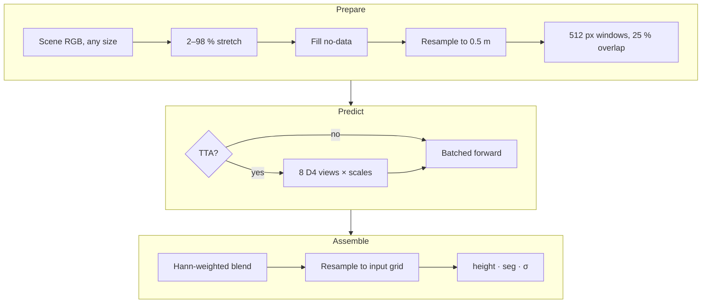

import Diagram from '../../../components/Diagram.astro';
import TilingDiagram from '../../../components/diagrams/TilingDiagram.astro';
import { Aside } from '@astrojs/starlight/components';

`predict_scene` in `Model_Traning/v5/infer/engine.py` is **the only inference path**. The CLI, the FastAPI service, the hosted Space and the sliding-window evaluation all call it, so the reported metrics describe what users actually get.

## Pipeline



## Tiling and blending

<Diagram caption="Windows are 512 px with 25 % overlap (stride 384 px). Each tile's prediction is weighted by a 2-D Hann window, which falls to zero at the tile border, then normalised by the summed weights. Scene edges are reflect-padded, never zero-padded. Zero padding in v2 training crops touched about 41 % of supervised pixels.">
	<TilingDiagram />
</Diagram>

| Parameter | Value |
|---|---|
| Canonical GSD | 0.5 m |
| Window | 512 × 512 px |
| Overlap | 0.25 (stride 384 px) |
| Blend | 2-D Hann window, normalised |
| Border handling | reflect padding |
| Precision | bf16 autocast on CUDA, fp32 on CPU |
| Batch | 4 tiles by default (`batch_tiles`) |

## Test-time augmentation

With TTA on, each tile runs through the **8 elements of the dihedral group D4** (4 rotations × optional flip). Each prediction is inverse-transformed and averaged, optionally at several scales (`tta_scales = (1.0, 1.25)`). The model checkpoint (`best.pt`) is chosen *without* TTA; TTA is applied only at evaluation and inference time.

## Large scenes

Scenes above **40 megapixels** go through `predict_scene_windowed` (`run_windowed` in the service). It processes horizontal bands of 2048 rows plus a one-tile margin and streams the GeoTIFF outputs straight to disk. A 20k × 20k px scene peaked at **5.9 GB RAM**.

## Outputs

| Array | Units | Notes |
|---|---|---|
| `height` | metres above ground | the nDSM, on the input grid |
| `seg` | class id 0–6 | argmax of Head C |
| `std` | metres | Head B spread; median about 0.25 m on a Cartosat-2E test scene |

See [Output formats](/system/outputs/) for the files written to disk.

## Command line

```bash title="Model_Traning/v5/"
python -m infer.predict scene.tif --ckpt outputs/v5/best.pt --tta           # nDSM (+ GeoTIFF if georeferenced)
python -m infer.predict scene.tif --ckpt outputs/v5/best.pt --absolute      # + DTM/DSM from Copernicus GLO-30
python -m infer.predict scene.tif --ckpt outputs/v5/best.pt --dem cartodem.tif
python -m infer.predict scene.png --ckpt outputs/v5/best.pt --gsd 0.5       # plain image, declared GSD
python -m infer.predict scene.tif --ckpt outputs/v5/best.pt --gcps gcps.csv # absolute via ground control points
python -m infer.predict scene.tif --ckpt outputs/v5/best.pt --report        # self-contained HTML report
```

<Aside>Every checkpoint stores its preprocessing recipe (`preproc`: encoder id, mean/std, canonical GSD, tile size, stretch percentiles). Inference reads it from there instead of from code, so old checkpoints keep working.</Aside>
