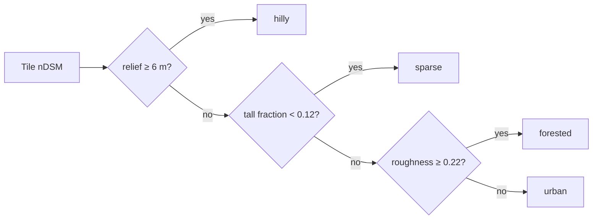

import Eq from '../../../components/Math.astro';
import { Aside } from '@astrojs/starlight/components';

Source: `Model_Traning/v5/eval/metrics.py`, `eval/landscape.py`, `eval/sliding.py`, `eval_test.py`. All metrics are computed over valid label pixels, in metres of height above ground.

## Global metrics

| Metric | Definition | Better |
|---|---|---|
| **RMSE** | <Eq tex="\sqrt{\tfrac1N\sum (\hat h - h)^2}" /> | lower |
| **MAE** | <Eq tex="\tfrac1N\sum \lvert \hat h - h\rvert" /> | lower |
| **Bias** | <Eq tex="\tfrac1N\sum (\hat h - h)" />. Positive means over-prediction | closer to 0 |
| **Pearson r** | linear correlation of prediction and truth | higher |
| **δ1** | share of pixels where <Eq tex="\max\!\left(\frac{\hat h+1}{h+1},\frac{h+1}{\hat h+1}\right) < 1.25" /> | higher |

The +1 m shift in δ1 keeps the ratio defined on flat ground (h ≈ 0).

## Distribution-aware metrics

Global RMSE is dominated by flat ground, which is roughly half of all pixels. These metrics expose what it hides:

| Metric | Definition |
|---|---|
| **Per-stratum RMSE / bias** | Metrics within height bands 0–2, 2–5, 5–10, 10–20 and 20+ m |
| **Balanced RMSE** | Mean of the five stratum RMSEs, so every band counts equally regardless of pixel share |
| **Tall bias** | Bias on pixels whose true height is above 15 m (under-prediction of tall structures) |
| **Flat bias** | Bias on pixels whose true height is below 1 m (phantom height on ground) |
| **Per-class** | Metrics per segmentation class (building, tree, …) |
| **Per-landscape** | Metrics per tile landscape (below), plus the spread and the worst landscape |

## Sharpness metrics (v5)

| Metric | Definition |
|---|---|
| **Edge RMSE** | RMSE within 2 px of a true height step greater than 2 m, where blur costs the most |
| **Gradient ratio** | <Eq tex="\sum \lvert\nabla \hat h\rvert \,/\, \sum \lvert \nabla h\rvert" />. 1.0 is as sharp as the truth; v5 measured 0.23 on MVS3DM |

## Landscape classifier

Each tile is labelled from its **own ground-truth height map** (`eval/landscape.py`), with rules checked in order:

## Evaluation protocols

| Protocol | What it scores | Used for |
|---|---|---|
| **Plain** | Centre crop of each validation tile, one forward pass | checkpoint selection (`best.pt`) |
| **TTA** | Same crops, averaged over 8 D4 views (± scales) | reported accuracy |
| **Sliding + TTA** | Whole tiles through `predict_scene`, exactly like the app | "what users get", including seams and edges |

`eval_test.py` runs all three with one protocol for v3, v4 and v5 checkpoints on held-out stores, and `--compare` writes a Markdown comparison table.

<Aside type="note" title="Georeferenced checks">
`eval/judge_proxy.py` scores an **absolute DSM** against SRTM or Copernicus per pixel and per 30 m cell, with a datum sanity check. `serve/validate.py` scores any job against an uploaded reference GeoTIFF: it reprojects the reference onto the prediction grid, converts the datum, and reports per-pixel, confident-pixel and 30 m-cell metrics.
</Aside>
