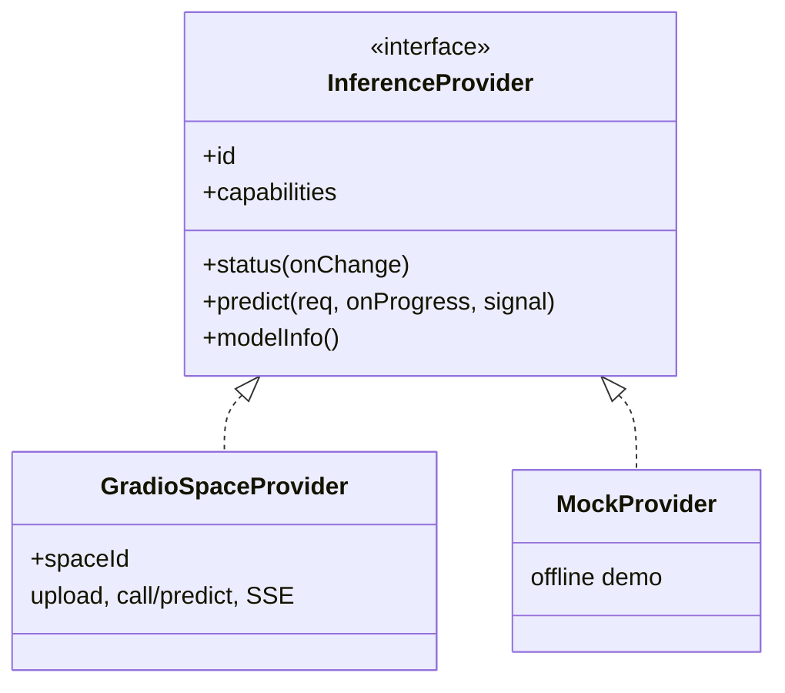
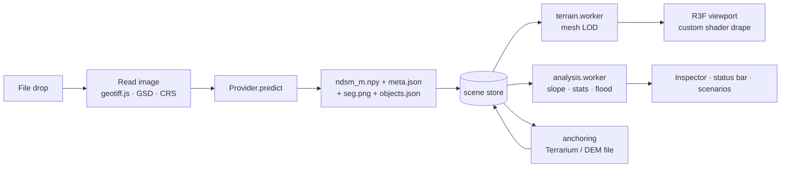

import { FileTree, Aside } from '@astrojs/starlight/components';

The web app is a single-page React application in `Frontend/`. It has no router: the workspace is one screen, and help pages open as dialogs or drawers.

## Stack

| Concern | Library |
|---|---|
| UI framework | React 19 · TypeScript (strict) · Vite 8 |
| Components | Mantine 9 (core, dropzone, modals, notifications) · Tabler icons |
| 3D | three.js 0.186 · React Three Fiber 9 · drei 10 · postprocessing (N8AO, SMAA) · three-custom-shader-material · camera-controls |
| State | zustand 5 |
| Workers | comlink |
| Charts | ECharts 6 |
| Geo | geotiff.js · proj4 · d3-contour |
| Files | fflate (zip) · idb-keyval (IndexedDB) |
| Tests | Vitest · Testing Library · Playwright + axe-core |

The production build is split into `three`, `charts`, `geo` and `mantine` chunks, and uses a relative `base: './'` so it works from any path.

## Source layout

<FileTree>
- Frontend/
  - api/ Vercel serverless functions (hf-space.js, overpass.js)
  - server/ Node production server + proxy (serve.mjs, overpass.mjs)
  - public/ logo, bundled sample scene
  - src/
    - api/ inference providers
      - provider.ts InferenceProvider interface
      - registry.ts provider selection
      - gradio/ GradioSpaceProvider, output + status parsing
      - errors.ts typed errors
    - store/ zustand stores: scene, camera, view, ui, settings, anchor, tool, usecases
    - features/
      - shell/ header, menus, shortcuts, status bar, backend status
      - input/ project panel (upload, GSD, TTA)
      - processing/ run orchestration + overlay
      - viewport/ canvas, cameras, overlays, scene graph
      - inspector/ Layers and Info tabs
      - validation/ reference metrics, charts, HTML report
      - anchoring/ DEM anchoring + product chip
      - basemap/ · osm/ · poi/ surroundings layers
      - usecases/ flood and telecom scenarios
      - files/ open, save project, exports
      - help/ docs drawer, shortcuts, model info, about
    - workers/ terrain.worker.ts, analysis.worker.ts
    - theme/ Mantine theme, CSS tokens, colormaps, class colours
</FileTree>

<Aside type="caution">Utility modules under `src/lib/` (npy parsing, GeoTIFF / georeferencing, DEM, OSM, exporters, metrics and more) are imported as `@/lib/*`, but they are **excluded by the repository's root `.gitignore`** (a Python-template `lib/` rule). A fresh clone cannot build until that rule is narrowed and the folder is committed.</Aside>

## Inference providers



`registry.ts` keeps one provider instance per configuration, so the Space connection is reused across runs. The provider can be chosen in **Settings** (*Hugging Face Space (live model)* or *Offline demo*).

## Data flow



- **Mesh building** and **analysis** run in Web Workers via comlink, keeping the UI responsive on large scenes.
- **Drape layers** (optical, height tint, hillshade, slope, classes, reference, error) are computed in a custom shader material on one mesh, so switching layers never rebuilds geometry.
- **Post-processing** (ambient occlusion, SMAA) turns itself off when the frame rate drops.
- **Settings** persist to `localStorage` (`dw.settings`, `dw.color-scheme`). **Recent projects**, with thumbnails, go to IndexedDB.

## Scripts

```bash
npm run dev        # Vite dev server + proxies
npm run build      # typecheck + production build
npm run serve      # node server/serve.mjs
npm run test       # Vitest
npm run e2e        # Playwright (+ axe accessibility checks)
npm run lint       # ESLint
npm run cache-dem  # pre-fetch DEM tiles for the bundled sample
```
