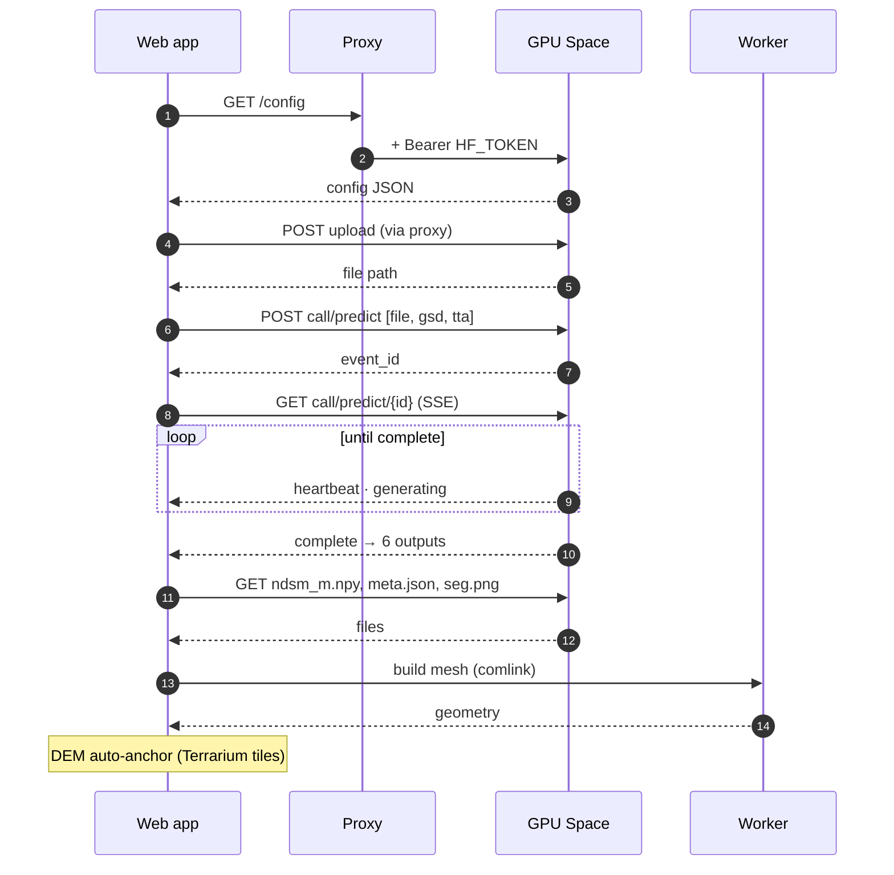

import { Aside } from '@astrojs/starlight/components';

Source: `Frontend/src/api/gradio/GradioSpaceProvider.ts`, `Frontend/server/serve.mjs`, `Frontend/api/hf-space.js`.

## Sequence

Every call from the web app goes through the same-origin proxy, which adds the token. The diagram shows the proxy hop once, for the first request.

## Processing stages shown to the user

| Stage | Trigger |
|---|---|
| Connecting | `GET /config` |
| Uploading | `POST /gradio_api/upload` |
| Waiting in queue | SSE stream open, no `generating` yet |
| Estimating heights (GPU) | `generating` / `heartbeat` events |
| Downloading results | fetching `ndsm_m.npy` and related files |
| Building 3D mesh | worker meshing, then DEM anchoring |

A typical run takes **15–45 s**, or **1–2 min with TTA**. The first request after the Space has been idle can take about a minute longer while it wakes up.

## Result files

| File | Required | Use |
|---|---|---|
| `ndsm_m.npy` | ✓ | Float32 height grid, the source for the mesh and all analysis |
| `meta.json` | — | Stats, GSD and its source, CRS / geotransform, preprocessing, encoding |
| `seg.png` | — | Class map for the *Object classes* layer and 3D objects |
| `objects.json` | — | Extracted buildings, trees and water bodies |

Georeferencing is rebuilt in the browser from `meta.json` and the original file (proj4 + geotiff.js), so the scene gets its CRS, compass and lat/lon read-out.

## Proxy behaviour

| Aspect | `server/serve.mjs` (Node / Docker) | `api/hf-space.js` (Vercel) |
|---|---|---|
| Upstream | `HF_SPACE_URL`, or derived from `VITE_SPACE_ID` | same |
| Auth | adds `Authorization: Bearer $HF_TOKEN` | same |
| Request headers | strips `cookie`, `origin`, `referer` | forwards only `accept`, `content-type`, `range`, `last-event-id` |
| Response | streams SSE unbuffered; strips `set-cookie` | streams; `maxDuration` 300 s |
| Static files | serves `dist/`, SPA fallback; hashed assets cached 1 year, `immutable` | Vercel CDN |

Because the browser only calls its own origin, **no CORS configuration is needed**.

The **Overpass relay** (`POST /overpass/<mirror>`) accepts only three mirrors (overpass-api.de, overpass.private.coffee, overpass.kumi.systems). The body must contain `data=` and be at most 16 KB, with a 55 s timeout.

## Error handling

The Space often reports failures as a *successful* response whose status text describes the problem, so the app classifies that text into typed errors (`src/api/errors.ts`):

| Kind | Shown as | Typical cause |
|---|---|---|
| `quota` | GPU quota used up | ZeroGPU allowance of the token's account exhausted |
| `unavailable` | Model service unavailable | Space sleeping, building or paused |
| `auth` | Access denied | Missing or invalid `HF_TOKEN` |
| `network` | Connection problem | Offline, or proxy unreachable |
| `inference` | Inference failed | Unreadable image, or a model error |
| `invalid-input` | Unsupported input | Not a PNG / JPG / (Geo)TIFF RGB image |
| `no-image` | No image received | Run started with nothing uploaded |
| `cancelled` | Run cancelled | User pressed Cancel |

Each error card offers **Retry**, **Connection settings**, **Open a sample** and **Dismiss**.
