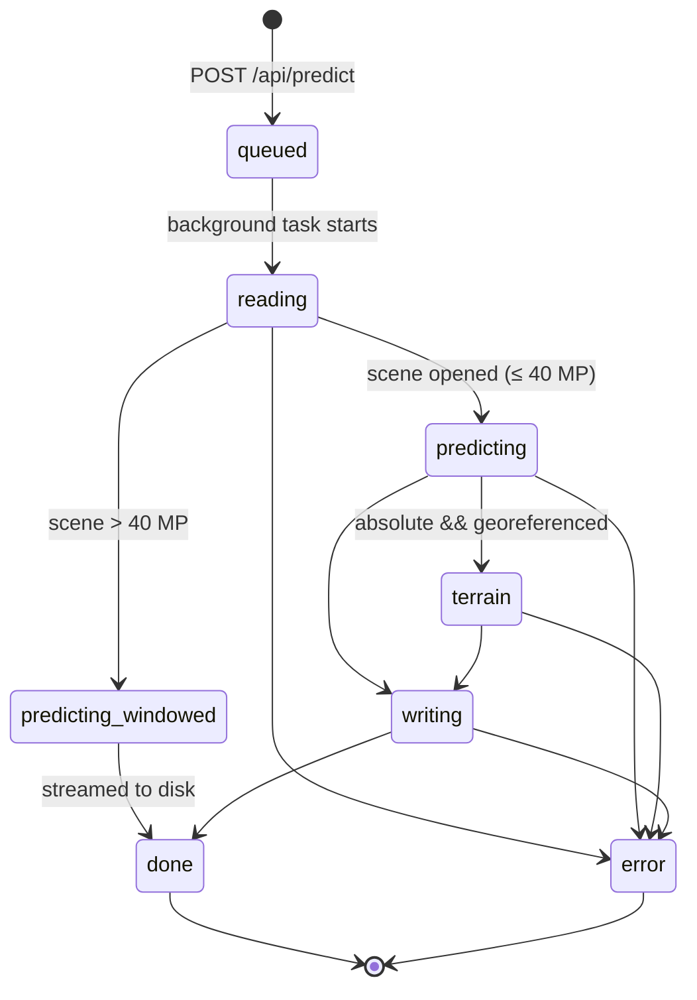

import { Tabs, TabItem, Aside, FileTree } from '@astrojs/starlight/components';

`Model_Traning/v5/serve/app.py` is a FastAPI + uvicorn service around the shared inference engine. It adds background jobs, absolute DSMs, reference validation, HTML reports and a bundled 3D viewer.

## Run it

Get the v5 weights from **[Kaggle Models](https://www.kaggle.com/models/abhaydkale232/depthwizard-v5)**, then start the service with the checkpoint or ONNX graph:

<Tabs>
<TabItem label="PyTorch (GPU)">

```bash
cd Model_Traning/v5
pip install -r requirements.txt
python -m serve.app --ckpt outputs/v5/best.pt --port 8000
# [serve] http://0.0.0.0:8000/   viewer at /viewer/index.html
```

</TabItem>
<TabItem label="ONNX Runtime (CPU / GPU)">

```bash
python -m serve.app --onnx outputs/v4/depthwizard.onnx
```

Keep `depthwizard.onnx.data` (about 1.3 GB of weights) next to the graph file. ONNX Runtime uses CUDA when it is available and falls back to CPU.

</TabItem>
<TabItem label="Environment variables">

```bash
DW_ONNX=/models/depthwizard.onnx DW_JOBS_DIR=/data/jobs uvicorn serve.app:app --port 8000
```

When `DW_CKPT` or `DW_ONNX` is set, the model loads at import time, so the app works under any ASGI server.

</TabItem>
</Tabs>

| Flag / variable | Default | Meaning |
|---|---|---|
| `--ckpt` / `DW_CKPT` | `outputs/v4/best.pt` | PyTorch checkpoint (its preprocessing recipe is embedded) |
| `--onnx` / `DW_ONNX` | — | ONNX graph instead of PyTorch |
| `--device` | auto | `cuda`, `cpu`, … |
| `--host` / `--port` | `0.0.0.0` / `8000` | bind address |
| `DW_JOBS_DIR` | `outputs/jobs` | where job directories are written |

## Job lifecycle



| Stage | Progress | What happens |
|---|---|---|
| `queued` | 0.00 | upload saved to `jobs/<id>/input.*` |
| `reading` | 0.05 | open scene, pick bands, resolve GSD |
| `predicting` | 0.15 → 0.85 | `predict_scene`, with `detail` = tiles done / total |
| `terrain` | 0.88 | DEM fetch + DTM / DSM (only with `absolute=true` on a georeferenced scene) |
| `writing` | 0.93 | GeoTIFFs, NPY, PNG previews, mesh, `meta.json` |
| `done` | 1.00 | `files` lists the outputs |
| `error` | — | `error` holds the message (the traceback is logged on the server) |

Poll `GET /api/job/{id}` until `stage` is `done` or `error`.

## Concurrency and safety

- The model sits behind a **single lock**, so jobs run one at a time on the GPU while uploads keep being accepted.
- Job state lives in memory and is lost on restart. The files in the job directory remain.
- Result paths are containment-checked, so a job id or file name from a URL cannot escape `DW_JOBS_DIR`. Multi-file uploads are flattened to base names.
- **No authentication or CORS middleware** is built in. Put the service behind your own gateway before exposing it.

## Job directory

<FileTree>
- outputs/jobs/
  - 88e63fd3329e/
    - input.tif the upload
    - meta.json stats, scene, preproc, datum, file list
    - rgb.png
    - ndsm16.png 16-bit preview (see encoding)
    - ndsm_m.npy / ndsm_m.tif height above ground
    - ndsm_std_m.npy / ndsm_std_m.tif uncertainty
    - dtm_m.tif / dsm_m.tif absolute products
    - seg.npy / seg.png classes
    - terrain.glb / terrain.obj / terrain.mtl / texture.png
    - shadow_img.png
    - report.html after GET /api/report/\{id\}
</FileTree>

<Aside>The bundled viewer at `/viewer/index.html?result=/api/result/<id>` (redirected from `/view/<id>`) is a build-free three.js page. It loads `ndsm_m.npy`, `meta.json` and `rgb.png` from any result directory.</Aside>
