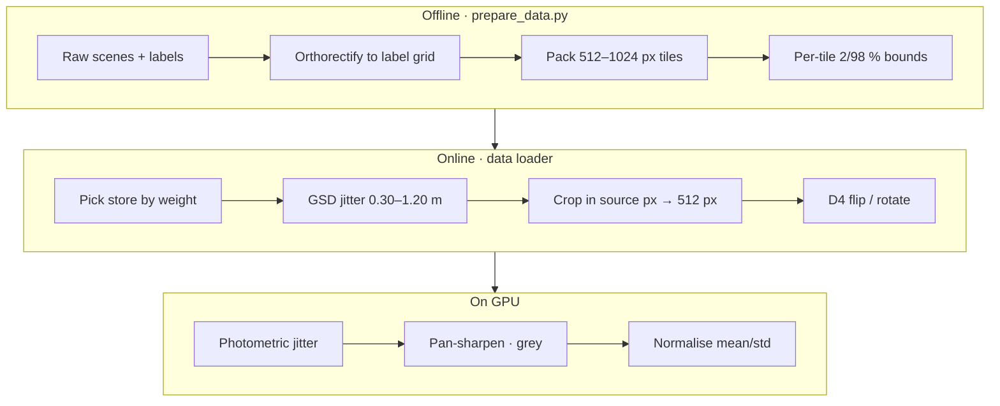

import { Aside } from '@astrojs/starlight/components';

## Pipeline

## Radiometric normalisation

Each scene is **contrast-stretched between its 2nd and 98th percentiles**, per band, then normalised with the encoder's statistics (mean 0.430 / 0.411 / 0.296, std 0.213 / 0.156 / 0.143). Stretch bounds are computed once per scene, and per tile at packing time, so training and inference see the same radiometry.

This fixed a cross-sensor failure. Without the per-scene stretch, an image from a different sensor gave a "crumpled mountain range": only 28 % of pixels below 1 m where 56 % was expected ([Design findings](/training/findings/#cross-sensor-radiometry)).

## Scale augmentation without padding

Real inputs range from 0.3 m aerial imagery to 1.0 m satellite imagery, so each training crop picks a random **target GSD in [0.30, 1.20] m** (p = 0.9). The crop is chosen **in source pixels**, so that resampling it to 512 px yields exactly the target GSD. It is never padded.

<Aside type="note">In v2 this crop was padded to 512 px. 76.5 % of samples were padded, 49.1 % were more than half padding, and about 41 % of supervised pixels were affected. The network was learning that black borders are ground. v3 removed padding entirely. Note that the 1.2 m upper end is never reached in practice, because the coarsest source tops out at about 0.66 m.</Aside>

## Augmentations

| Augmentation | Setting | Where |
|---|---|---|
| D4 flips / rotations | 8 symmetries, uniform | loader |
| Brightness · contrast | ±0.25 each | GPU, p 0.9 |
| Saturation · gamma | 0.35 each | GPU, p 0.9 |
| Per-channel gain | 0.12 | GPU, p 0.9 |
| Gaussian blur | p 0.2 (0.3 in the final run) | GPU |
| Gaussian noise | std 0.015 | GPU |
| **Pan-sharpen simulation** (v5) | chroma downsampled 2.0–3.3×, p 0.5 | GPU |
| **Greyscale** (v5) | p 0.1 | GPU |

The two v5 augmentations target **Cartosat** products. Cartosat MX (1.6 m) is fused with PAN (0.6 m), so colour is much blurrier than luminance, and some inputs are PAN-only.

## Sampling

Stores are drawn according to `sampler_weights`. The v5 final run used:

| Store | Weight |
|---|---|
| GAMUS | 2.5 |
| NEON | 2.0 |
| MVS3DM | 1.5 |
| US3D | 1.0 |
| SynRS3D g05 | 1.0 |
| SynRS3D g1 | 0.5 |

Within each store, forested tiles are drawn 2× and sparse tiles 1.5× as often as urban ones (`landscape_sampler_boost`). An epoch is a fixed number of random crops (default 12,000; 36,000 on the final Modal run), not a pass over the dataset.
