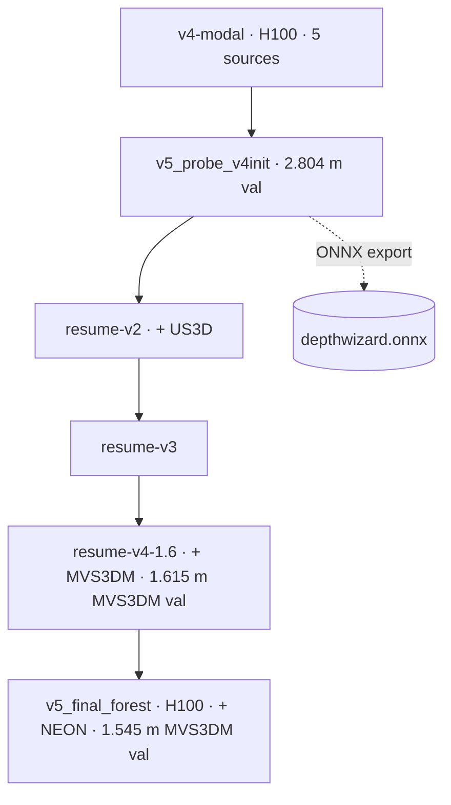

import Chart from '../../../components/Chart.astro';
import PrelimBadge from '../../../components/PrelimBadge.astro';
import VersionTimeline from '../../../components/VersionTimeline.astro';
import { Aside } from '@astrojs/starlight/components';

DepthWizard was rebuilt four times. Each version responded to something the previous one *measured*, not to a guess.

<VersionTimeline
	items={[
		{ v: 'v1', date: 'Sep 7', title: 'Frozen DINOv3-SAT + DPT, Head A only. A 28-minute baseline on 2×T4.', metric: '3.32 m val' },
		{ v: 'v2', date: 'Sep 8', title: 'Adaptive bins, segmentation, gate; SynRS3D pretraining.', metric: '3.07 m val', note: 'crashed at epoch 21', tone: 'warn' },
		{ v: 'v3', date: 'Sep 13', title: 'Encoder actually unfrozen; no-padding crops, per-scene stretch, stratum balancer.', metric: '2.61 m val (TTA)', tone: 'best' },
		{ v: 'v4', date: 'Sep 20', title: 'Geo calibration, ONNX, FastAPI; more data, β 0.7, soft bins.', metric: '3.32 m GAMUS test' },
		{ v: 'v5', date: 'Sep 29', title: "Reverts v4's regressions; detail branch, coarse labels, forest data.", metric: '2.48 m selection', note: 'preliminary', tone: 'prelim' },
	]}
/>

## What changed, and why

| Version | Main change | Motivated by | Result (GAMUS val unless noted) |
|---|---|---|---|
| **v1** | Frozen DINOv3-SAT encoder, DPT decoder, Head A only. 11.3 M of 314.4 M params trainable | Ship a baseline first | 3.321 m RMSE, r 0.856 |
| **v2** | Heads B and C, gated fusion, SynRS3D → GAMUS curriculum, streaming data | The planned Phase 2 architecture | 3.068 m at epoch 18. Crashed at epoch 21, and the encoder was never unfrozen |
| **v3** | Structural encoder-block lookup, full unfreeze, no-padding crops, per-scene stretch, photometric jitter, stratum balancer, flatness and normal losses | v2 post-mortem: 41 % padding, cross-sensor failure, tall bias −5.3 m | **2.715** plain · **2.605** TTA · 2.723 sliding |
| **v4** | Georeferenced calibration, ONNX export, FastAPI service, landscape metrics. β 0.7, soft bins, entropy term, top-16 unfreeze, DFC23 + India data | Deliver the full product | modal: 3.631 TTA val; **3.321** GAMUS test (TTA) |
| DAv2 | Depth Anything V2 Base backbone + pretrained DPT neck | Backbone ablation | 3.432 TTA val; 3.396 GAMUS test (TTA) |
| **v5** | Revert v4's 5 regressive settings; detail branch; coarse-label loss; corrected class ids; seeded val; DEM-anchored DSM; Cartosat input path | v4 regressed on flat ground (85.5 % of the gap); maps too smooth | 2.804 seeded val (Kaggle); final run 2.481 selection score <PrelimBadge /> |

<Chart
	height={340}
	caption="Best single-pass (no TTA) validation RMSE per run. Validation sets differ: v1/v2 used an earlier subset, v4 runs a harder 400-tile prefix with 2.1× more tall pixels, and v5 a seeded random 400. Treat the bars as a history, not a leaderboard; the same-protocol test comparison is on the Benchmarks page."
	source="src/data/metrics.json ← Model_Traning/*/metrics.json, Research-Paper/main.tex Table III"
	option={{
		tooltip: { trigger: 'axis', axisPointer: { type: 'shadow' } },
		grid: { left: 50, right: 20, top: 30, bottom: 40 },
		xAxis: { type: 'category', data: ['v1', 'v2', 'v3', 'v4-Kaggle', 'v4-2', 'v4-modal', 'DAv2', 'v5 (Kaggle)'] },
		yAxis: { type: 'value', name: 'RMSE (m)', min: 0 },
		series: [
			{
				type: 'bar',
				barWidth: '55%',
				data: [3.321, 3.068, { value: 2.715, itemStyle: { color: '#1f9a63' } }, 3.427, 3.803, 3.754, 3.522, 2.804],
				label: { show: true, position: 'top', fontSize: 11 },
			},
		],
	}}
/>

## Checkpoint lineage

v5 runs are warm-started chains, not trained from scratch. This is inferred from run directory names and resume paths:

<Aside type="caution" title="Which checkpoint is where">
- **ONNX graph** (`best.onyx/v5_probe_v4init_onnx`): exported from `v5_probe_v4init`, not from the final run.
- **v5 final run** (`v5_final_forest/best.pt`, about 2.5 GB, stored on a Modal volume): not yet evaluated on held-out test splits and not yet exported to ONNX.
- **Hosted Space**: serves a DINOv3 ViT-L/16 checkpoint. Which version is live is not recorded in this repository.
</Aside>

## Lessons that carried across versions

1. **Ship a baseline first.** v1 took 28 minutes and gave every later change a reference number.
2. **Log metrics continuously and per stratum.** Global RMSE hid v2's padding problem and v4's ground regression.
3. **Measure before you change.** Each v3 fix points to a measurement from the v2 post-mortem.
4. **Change one thing at a time.** v4 changed five loss and schedule settings at once, and it took a dedicated analysis (`V4_modal/v3VSv4.md`) to attribute the regression.
5. **Don't quote numbers you can't reproduce.** Every figure on this site comes from a `metrics.json`, a `run.log` or a results file.
