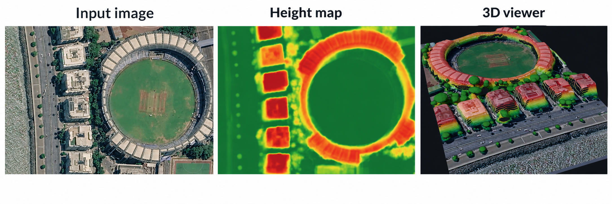
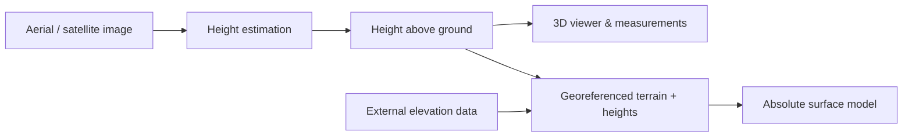

# 🛰️ Single-View 3D Mapping

Turn one Aerial or Satellite Image into estimated heights and an interactive 3D scene.

**[🌐 Open app](https://depthwizard.teamendra.tech/)** · **[📖 Documentation](https://depthwizard-docs.vercel.app/)** · **[🧠 Kaggle model](https://www.kaggle.com/models/abhaydkale232/depthwizard-v5)** · **[💻 Desktop downloads](https://github.com/AbhayKale332/DW-Team_ENDRA/releases)**

## ▶️ Watch the Demo

<p align="center">
  <a href="https://youtu.be/EKys48tC0X8"></a>
</p>

## 🏔️ From image to 3D



*Wankhede Stadium, Mumbai. Left to right: input image → predicted height map → 3D viewer. Imagery © Google Earth.*

| 🖼️ Import | 🏔️ Explore | 📏 Measure | 📦 Export |
|---|---|---|---|
| PNG, JPG, GeoTIFF | 3D scenes, height maps, layers | Heights, slopes, profiles | GeoTIFF, GLB, OBJ, PLY, STL |



## 📊 Results

| GAMUS validation metric | Single pass | D4 + 1.5× input scaling |
|---|---:|---:|
| Overall RMSE | 2.775 m | **2.590 m** |
| Urban RMSE | 3.211 m | **3.061 m** |
| Sparse RMSE | 2.210 m | **1.253 m** |
| Forested RMSE | 2.126 m | **2.052 m** |

**2.775 → 2.590 m RMSE** on 859 GAMUS validation tiles. D4 averages eight rotations/reflections; this setting takes about **14× longer** and increases error for heights ≥15 m. These are validation results.

[Evaluation details](Docs-Site/src/content/docs/results/gamus-d4.mdx) · [Raw metrics](Docs-Site/public/evidence/v5-gamus-d4/probe_metrics.json) · [Benchmarks](Docs-Site/src/content/docs/results/benchmarks.mdx) · [Image gallery](Docs-Site/src/content/docs/results/gallery.mdx)

## 🚀 Try it locally

```bash
cd Frontend
npm install
npm run dev
```

Open `http://localhost:5173` and choose **Try a sample scene**. For inference, follow the [frontend setup](Frontend/README.md) to configure access to the hosted model.

## 🧠 Models, data & notebooks

| Resource | Links |
|---|---|
| v5 model | [Kaggle weights](https://www.kaggle.com/models/abhaydkale232/depthwizard-v5) · [Model card](Model_Traning/v5/KAGGLE_MODEL_CARD.md) · [Usage](Model_Traning/v5/KAGGLE_USAGE.md) |
| GAMUS | [Kaggle](https://www.kaggle.com/datasets/abhaydkale232/depthwizard-gamus) · [Hugging Face](https://huggingface.co/datasets/earthflow/GAMUS) |
| SynRS3D | [Kaggle](https://www.kaggle.com/datasets/abhaydkale232/depthwizard-synrs3d-g05) · [Hugging Face](https://huggingface.co/datasets/JTRNEO/SynRS3D) |
| US3D | [Kaggle](https://www.kaggle.com/datasets/abhaydkale232/depthwizard-us3d) · [Source](https://ieee-dataport.org/open-access/data-fusion-contest-2019-dfc2019) |
| DFC2023 | [Kaggle](https://www.kaggle.com/datasets/abhaydkale232/dfc23-track2-height-estimation) · [Data audit](DOCS/CompetitionContext/DFC23_Track2_Data_Audit.md) |
| MVS3DM | [Kaggle](https://www.kaggle.com/datasets/abhaydkale232/depthwizard-mvs3dm) · [Source](https://spacenet.ai/iarpa-multi-view-stereo-3d-mapping/) |
| NEON | [Kaggle](https://www.kaggle.com/datasets/abhaydkale232/depthwizard-neon) · [Source](https://data.neonscience.org/data-products/DP3.30015.001) |
| v5 notebooks | [Train](Model_Traning/v5/kaggle_train.ipynb) · [GAMUS + SynRS3D](Model_Traning/v5/Notebook/kaggle_train_gamus_synrs3d.ipynb) · [Evaluate](Model_Traning/v5/Notebook/kaggle_test.ipynb) · [Export ONNX](Model_Traning/v5/Notebook/kaggle_export_onnx.ipynb) |
| Hosted inference | [Hugging Face Space](https://huggingface.co/spaces/akashch1512/SingleViewHeigthEstimation) |
| Earlier resources | [IM2ELEVATION weights](https://drive.google.com/file/d/1KZ50MQY5Fof8SAoJN34bxnk7mfou4frF/view?usp=sharing) · [OSI dataset](https://drive.google.com/drive/folders/14sBkjeYY7R1S9NzWI5fGLX8XTuc8puHy?usp=sharing) |

## 📚 Documentation

| Start here | Links |
|---|---|
| Use the app | [Quick start](Docs-Site/src/content/docs/overview/quickstart.mdx) · [First estimate](Docs-Site/src/content/docs/guide/first-estimate.mdx) · [Export](Docs-Site/src/content/docs/guide/export.mdx) |
| Run & build | [Frontend](Frontend/README.md) · [Desktop](Desktop/README.md) · [Docs site](Docs-Site/README.md) · [Deployment](Docs-Site/src/content/docs/system/deployment.mdx) |
| Train & evaluate | [V5 guide](Model_Traning/v5/README.md) · [Datasets](Docs-Site/src/content/docs/training/datasets.mdx) · [Training recipe](Docs-Site/src/content/docs/training/recipe.mdx) · [Validation examples](Frontend/validation-examples/README.md) |
| Understand the model | [Architecture](Docs-Site/src/content/docs/model/overview.mdx) · [API](Docs-Site/src/content/docs/system/api-reference.mdx) · [Limitations](Docs-Site/src/content/docs/reference/limitations.mdx) |
| Research & history | [Papers](DOCS/CompetitionContext/Research_Papers) · [References](Docs-Site/src/content/docs/references.mdx) · [Development blog](DOCS/blog/README.md) · [Changelog](Docs-Site/src/content/docs/reference/changelog.mdx) |

<details>
<summary>Browse the full documentation index</summary>

| Topic | Pages |
|---|---|
| Overview | [Introduction](Docs-Site/src/content/docs/index.mdx) · [Motivation](Docs-Site/src/content/docs/overview/motivation.mdx) · [Concepts](Docs-Site/src/content/docs/overview/concepts.mdx) · [Downloads](Docs-Site/src/content/docs/download.mdx) |
| User guide | [Interface](Docs-Site/src/content/docs/guide/interface.mdx) · [Navigation](Docs-Site/src/content/docs/guide/navigation.mdx) · [Layers](Docs-Site/src/content/docs/guide/layers.mdx) · [Validation](Docs-Site/src/content/docs/guide/validation.mdx) · [Anchoring](Docs-Site/src/content/docs/guide/anchoring.mdx) · [Scenarios](Docs-Site/src/content/docs/guide/scenarios.mdx) · [Shortcuts](Docs-Site/src/content/docs/guide/shortcuts.mdx) · [Troubleshooting](Docs-Site/src/content/docs/guide/troubleshooting.mdx) |
| Model | [Encoder](Docs-Site/src/content/docs/model/encoder.mdx) · [Decoder & heads](Docs-Site/src/content/docs/model/decoder-heads.mdx) · [Losses](Docs-Site/src/content/docs/model/losses.mdx) · [Inference](Docs-Site/src/content/docs/model/inference.mdx) |
| Training | [Preprocessing](Docs-Site/src/content/docs/training/preprocessing.mdx) · [Versions](Docs-Site/src/content/docs/training/versions.mdx) · [Findings](Docs-Site/src/content/docs/training/findings.mdx) · [Dataset suggestions](Model_Traning/v5/DATASET_SUGGESTIONS.md) · [Resolution notes](Model_Traning/v5/US3D_AND_GSD_NOTES.md) · [Lightning workflow](Model_Traning/v5/lightning/AFTER_NEON_UPLOAD.md) |
| Evaluation | [Metrics](Docs-Site/src/content/docs/results/metrics.mdx) · [Encoder comparison](Docs-Site/src/content/docs/results/encoder-comparison.mdx) · [Landscape accuracy](Docs-Site/src/content/docs/results/landscape-accuracy.mdx) · [Error analysis](Docs-Site/src/content/docs/results/error-analysis.mdx) · [LiDAR validation](Docs-Site/src/content/docs/results/lidar-validation.mdx) · [Cartosat validation](Docs-Site/src/content/docs/results/cartosat-validation.mdx) · [Evaluation walkthrough](Docs-Site/src/content/docs/judges.mdx) |
| Geospatial | [Scale recovery](Docs-Site/src/content/docs/geo/scale-recovery.mdx) · [Absolute DSM](Docs-Site/src/content/docs/geo/absolute-dsm.mdx) · [Elevation sources](Docs-Site/src/content/docs/geo/dem-sources.mdx) |
| System | [Overview](Docs-Site/src/content/docs/system/overview.mdx) · [Hosted inference](Docs-Site/src/content/docs/system/hosted-path.mdx) · [Self hosting](Docs-Site/src/content/docs/system/self-hosted.mdx) · [Outputs](Docs-Site/src/content/docs/system/outputs.mdx) · [ONNX](Docs-Site/src/content/docs/system/onnx.mdx) · [Frontend architecture](Docs-Site/src/content/docs/system/frontend-architecture.mdx) |
| Earlier training | [Overview](Model_Traning/README.md) · [v1](Model_Traning/v1/README_PHASE0.md) · [v2](Model_Traning/v2/README_PHASE0_V2.md) · [v3](Model_Traning/v3/README.md) · [v4](Model_Traning/v4/README.md) · [v4 Kaggle](Model_Traning/V4_Kaggle/README.md) · [v4 Modal](Model_Traning/V4_modal/README.md) · [Depth Anything V2](Model_Traning/DAV2_V1/README.md) · [Kaggle file layout](Model_Traning/Kaggle_File_Structure.md) |
| More resources | [Team & credits](Docs-Site/src/content/docs/reference/team.mdx) · [Desktop releases](Desktop/RELEASE_NOTES.md) · [Build optimization](Desktop/BUILD_OPTIMIZATION.md) · [Source papers](DOCS/CompetitionContext/Research_Papers) · [Project notes](DOCS) · [Training files & notebooks](Model_Traning) · [License](LICENSE) |

</details>

