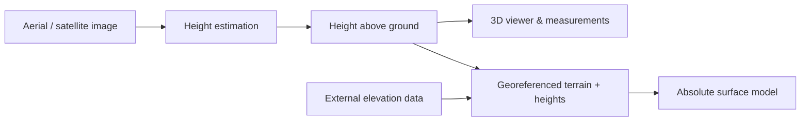

# 🛰️ Single-View 3D Mapping

Turn one Aerial or Satellite Image into estimated heights and an interactive 3D scene.

<p>
  <a href="https://depthwizard.teamendra.tech/"></a>
  <a href="https://depthwizard-docs.vercel.app/"></a>
  <a href="https://www.kaggle.com/models/abhaydkale232/depthwizard-v5"></a>
  <a href="https://huggingface.co/spaces/akashch1512/SingleViewHeigthEstimation"></a>
  <a href="https://github.com/AbhayKale332/DW-Team_ENDRA/releases"></a>
  <a href="https://youtu.be/EKys48tC0X8"></a>
</p>

<p>
  
  
  
  
  
  
  <a href="LICENSE"></a>
</p>

## ▶️ Watch the Demo

<p align="center">
  <a href="https://youtu.be/EKys48tC0X8"></a>
</p>

## 🏔️ From image to 3D


*Wankhede Stadium, Mumbai. Left to right: input image → predicted height map → 3D viewer. Imagery © Google Earth.*

| 🖼️ Import | 🏔️ Explore | 📏 Measure | 📦 Export |
|---|---|---|---|
| PNG, JPG, GeoTIFF | 3D scenes, height maps, layers | Heights, slopes, profiles | GeoTIFF, GLB, OBJ, PLY, STL |



## 📊 Results

| GAMUS validation metric | Single pass | D4 + 1.5× input scaling |
|---|---:|---:|
| Overall RMSE | 2.775 m | **2.590 m** |
| Urban RMSE | 3.211 m | **3.061 m** |
| Sparse RMSE | 2.210 m | **1.253 m** |
| Forested RMSE | 2.126 m | **2.052 m** |

**2.775 → 2.590 m RMSE** on 859 GAMUS validation tiles. D4 averages eight rotations/reflections; this setting takes about **14× longer** and increases error for heights ≥15 m. These are validation results.

🔬 [Evaluation details](https://depthwizard-docs.vercel.app/results/gamus-d4/) · 📄 [Raw metrics](https://depthwizard-docs.vercel.app/evidence/v5-gamus-d4/probe_metrics.json) · 🏁 [Benchmarks](https://depthwizard-docs.vercel.app/results/benchmarks/) · 🖼️ [Image gallery](https://depthwizard-docs.vercel.app/results/gallery/)

## 🚀 Try it locally

```bash
cd Frontend
npm install
npm run dev
```

Open `http://localhost:5173` and choose **Try a sample scene**. For inference, follow the [quick start](https://depthwizard-docs.vercel.app/overview/quickstart/) to configure access to the hosted model.

## 🧠 Models & data

| Resource | Links |
|---|---|
| 🧠 v5 model | [Kaggle weights](https://www.kaggle.com/models/abhaydkale232/depthwizard-v5) · [Architecture](https://depthwizard-docs.vercel.app/model/overview/) · [Inference](https://depthwizard-docs.vercel.app/model/inference/) |
| 🏙️ GAMUS | [Kaggle](https://www.kaggle.com/datasets/abhaydkale232/depthwizard-gamus) · [Hugging Face](https://huggingface.co/datasets/earthflow/GAMUS) |
| 🧪 SynRS3D | [Kaggle](https://www.kaggle.com/datasets/abhaydkale232/depthwizard-synrs3d-g05) · [Hugging Face](https://huggingface.co/datasets/JTRNEO/SynRS3D) |
| 🌆 US3D | [Kaggle](https://www.kaggle.com/datasets/abhaydkale232/depthwizard-us3d) · [Source](https://ieee-dataport.org/open-access/data-fusion-contest-2019-dfc2019) |
| 🏆 DFC2023 | [Kaggle](https://www.kaggle.com/datasets/abhaydkale232/dfc23-track2-height-estimation) · [Dataset notes](https://depthwizard-docs.vercel.app/training/datasets/) |
| 🛰️ MVS3DM | [Kaggle](https://www.kaggle.com/datasets/abhaydkale232/depthwizard-mvs3dm) · [Source](https://spacenet.ai/iarpa-multi-view-stereo-3d-mapping/) |
| 🌲 NEON | [Kaggle](https://www.kaggle.com/datasets/abhaydkale232/depthwizard-neon) · [Source](https://data.neonscience.org/data-products/DP3.30015.001) |
| 📓 Training & export | [Training recipe](https://depthwizard-docs.vercel.app/training/recipe/) · [Version history](https://depthwizard-docs.vercel.app/training/versions/) · [ONNX export](https://depthwizard-docs.vercel.app/system/onnx/) |
| 🤗 Hosted inference | [Hugging Face Space](https://huggingface.co/spaces/akashch1512/SingleViewHeigthEstimation) |
| 🗄️ Earlier resources | [IM2ELEVATION weights](https://drive.google.com/file/d/1KZ50MQY5Fof8SAoJN34bxnk7mfou4frF/view?usp=sharing) · [OSI dataset](https://drive.google.com/drive/folders/14sBkjeYY7R1S9NzWI5fGLX8XTuc8puHy?usp=sharing) |

## 📚 Documentation

| Start here | Links |
|---|---|
| 🖱️ Use the app | [Quick start](https://depthwizard-docs.vercel.app/overview/quickstart/) · [First estimate](https://depthwizard-docs.vercel.app/guide/first-estimate/) · [Export](https://depthwizard-docs.vercel.app/guide/export/) |
| 🛠️ Run & build | [Local setup](https://depthwizard-docs.vercel.app/overview/quickstart/) · [Desktop app](https://depthwizard-docs.vercel.app/download/) · [Self hosting](https://depthwizard-docs.vercel.app/system/self-hosted/) · [Deployment](https://depthwizard-docs.vercel.app/system/deployment/) |
| 🏋️ Train & evaluate | [Datasets](https://depthwizard-docs.vercel.app/training/datasets/) · [Training recipe](https://depthwizard-docs.vercel.app/training/recipe/) · [Validation](https://depthwizard-docs.vercel.app/guide/validation/) |
| 🧩 Understand the model | [Architecture](https://depthwizard-docs.vercel.app/model/overview/) · [API](https://depthwizard-docs.vercel.app/system/api-reference/) · [Limitations](https://depthwizard-docs.vercel.app/reference/limitations/) |
| 📜 Research & history | [Findings](https://depthwizard-docs.vercel.app/training/findings/) · [References](https://depthwizard-docs.vercel.app/references/) · [Development blog](DOCS/blog/README.md) · [Changelog](https://depthwizard-docs.vercel.app/reference/changelog/) |

<details>
<summary>🗂️ Browse the full documentation index</summary>

| Topic | Pages |
|---|---|
| 🧭 Overview | [Introduction](https://depthwizard-docs.vercel.app/) · [Motivation](https://depthwizard-docs.vercel.app/overview/motivation/) · [Concepts](https://depthwizard-docs.vercel.app/overview/concepts/) · [Downloads](https://depthwizard-docs.vercel.app/download/) |
| 📘 User guide | [Interface](https://depthwizard-docs.vercel.app/guide/interface/) · [Navigation](https://depthwizard-docs.vercel.app/guide/navigation/) · [Layers](https://depthwizard-docs.vercel.app/guide/layers/) · [Validation](https://depthwizard-docs.vercel.app/guide/validation/) · [Anchoring](https://depthwizard-docs.vercel.app/guide/anchoring/) · [Scenarios](https://depthwizard-docs.vercel.app/guide/scenarios/) · [Shortcuts](https://depthwizard-docs.vercel.app/guide/shortcuts/) · [Troubleshooting](https://depthwizard-docs.vercel.app/guide/troubleshooting/) |
| 🧠 Model | [Encoder](https://depthwizard-docs.vercel.app/model/encoder/) · [Decoder & heads](https://depthwizard-docs.vercel.app/model/decoder-heads/) · [Losses](https://depthwizard-docs.vercel.app/model/losses/) · [Inference](https://depthwizard-docs.vercel.app/model/inference/) |
| 🏋️ Training | [Preprocessing](https://depthwizard-docs.vercel.app/training/preprocessing/) · [Versions](https://depthwizard-docs.vercel.app/training/versions/) · [Findings](https://depthwizard-docs.vercel.app/training/findings/) |
| 📈 Evaluation | [Metrics](https://depthwizard-docs.vercel.app/results/metrics/) · [Encoder comparison](https://depthwizard-docs.vercel.app/results/encoder-comparison/) · [Landscape accuracy](https://depthwizard-docs.vercel.app/results/landscape-accuracy/) · [Error analysis](https://depthwizard-docs.vercel.app/results/error-analysis/) · [LiDAR validation](https://depthwizard-docs.vercel.app/results/lidar-validation/) · [Cartosat validation](https://depthwizard-docs.vercel.app/results/cartosat-validation/) · [Evaluation walkthrough](https://depthwizard-docs.vercel.app/judges/) |
| 🌍 Geospatial | [Scale recovery](https://depthwizard-docs.vercel.app/geo/scale-recovery/) · [Absolute DSM](https://depthwizard-docs.vercel.app/geo/absolute-dsm/) · [Elevation sources](https://depthwizard-docs.vercel.app/geo/dem-sources/) |
| ⚙️ System | [Overview](https://depthwizard-docs.vercel.app/system/overview/) · [Hosted inference](https://depthwizard-docs.vercel.app/system/hosted-path/) · [Self hosting](https://depthwizard-docs.vercel.app/system/self-hosted/) · [Outputs](https://depthwizard-docs.vercel.app/system/outputs/) · [ONNX](https://depthwizard-docs.vercel.app/system/onnx/) · [Frontend architecture](https://depthwizard-docs.vercel.app/system/frontend-architecture/) |
| 📦 More resources | [Team & credits](https://depthwizard-docs.vercel.app/reference/team/) · [Desktop releases](https://github.com/AbhayKale332/DW-Team_ENDRA/releases) · [License](LICENSE) |

</details>

